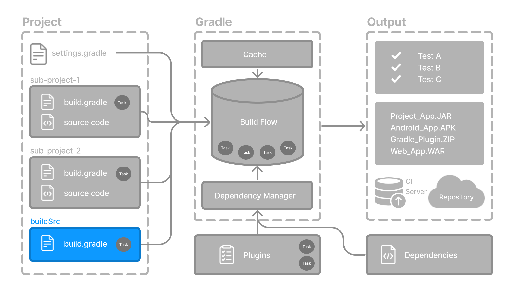

# Guidelines for Adaptation

This is a starter repository for a Java project composed of multiples inter-related subprojects.
Each subproject can be developed and deployed autonomously, but they share fundamental common definitions.
Examples:
- Java Application with libraries
- Set of related Service Applications

## Gradle Multi Projects

A gradle multi project is introduced [here](https://docs.gradle.org/current/userguide/intro_multi_project_builds.html).

A deeper explanation is found in [Sharing Build Logic between Subprojects](https://docs.gradle.org/current/userguide/sharing_build_logic_between_subprojects.html), using convention plugins.

This repo was built from the instructions on gradle's [Building Java Applications with libraries Sample](https://docs.gradle.org/current/samples/sample_building_java_applications_multi_project.html).

## Adapting

Instructions on how to adapt this for your project.

### Components

Component samples:
- [list](./list) is a sample of an internal library.
- [utilities](./utilities) is a sample of shareable library, exposed externally, that depends on the internal library.
- [app](./app) is a sample of an executable code, as an application or a service, that depends on project libraries.

These samples can be used as a starting point for new similar components.

### Common Dependencies Catalog

A [dependencies catalog](./gradle/libs.versions.toml) defines the proper version for each one.

### Convention Plugins

Convention Plugins are defined into [buildSrc](./buildSrc) to enable easy reusability of definitions and build configurations.

The provided ones:

- [Common](./buildSrc/src/main/kotlin/buildlogic.java-common-conventions.gradle.kts) has the fundamental definitions for all java components.
- [Library](./buildSrc/src/main/kotlin/buildlogic.java-library-conventions.gradle.kts) has complementary definitions for libraries.
- [Application](./buildSrc/src/main/kotlin/buildlogic.java-application-conventions.gradle.kts) has complementary definitions for executables (applications or services).

They can be adapted and extended.

